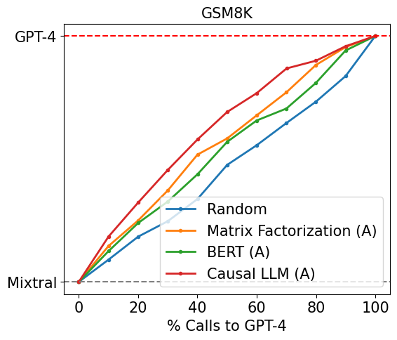
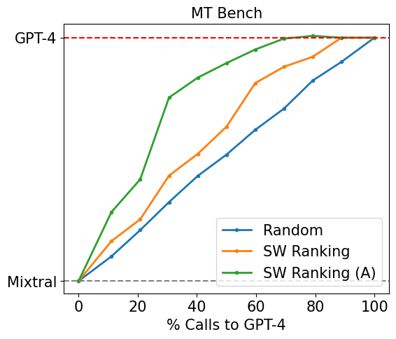

# RouteLLM

RouteLLM is a framework for serving and evaluating large language model routers.

<p align="center">
  
</p>

Our core features include:

- Launch an OpenAI-compatible API that takes in user requests and routes them to the best model for that specific request using a single command.
- Trained routers are provided out of the box, which we have shown to reduce cost **by over 2 times** without compromising quality on widely-used benchmarks such as MT Bench.
- Easily extend the framework to include new routers and benchmarks, and compare the performance of all routers with a single command.

## Installation

**From PyPI**
```
# Modify extras depending on your use case.
pip install "routellm[serve,eval]"
```


**From source:**

```
git clone https://github.com/lm-sys/RouteLLM.git
cd RouteLLM
# Modify extras depending on your use case.
pip install -e .[serve,eval]
```

## Motivation

*Not all LLMs are created equal*. There exists wide variation in the costs and capabilities of different models, which leads to a dilemma when deploying LLMs in the real-world: routing all queries to the largest, most capable model leads to the highest-quality responses, but can be prohibitively expensive, whereas routing queries to smaller models can save costs significantly but may result in lower-quality responses. LLM routing is our solution to this problem.

Our core setup is routing between a pair of LLMs - a stronger, more expensive model and a weak, cheaper model. Each router takes in **only** the user prompt, and decides which LLM to route that request to using any strategy. Each routing request is also associated with a _cost threshold_, which is a user-specified value between 0 and 1 that determines the cost-quality tradeoff of that request. A higher cost threshold translates to lower cost but may also lead to lower quality responses.

<!-- <p float="left">
  
  
</p> -->

## Server

RouteLLM offers a lightweight OpenAI-compatible server for routing requests between two LLMs based on different routing strategies. The server can be started with the following command:

```
python -m routellm.openai_server --config config.example.yaml --routers mf
```

- `--routers` specifies the list of routers available to the server. For instance, here, the server is started with one available router: `mf`.
- `--config` specifies the path to the configuration file, which contains the paths and settings required by each router.

Users should specify which router and what cost threshold to use for each request using the `model` field in the following format `router-[ROUTER NAME]-[THRESHOLD]`. For instance, using model name of `router-mf-0.5` specifies that the request should be routed using the matrix factorization router with a cost threshold of 0.5.

### Server Authentication

For OpenAI models, the server will route requests to the official OpenAI client, so you will need to set the `OPENAI_API_KEY` environment variable before launching the server. For all other models, you nede to configure an alternative OpenAI-compatible server, which can be configured with the `--alt-base-url` and `alt-api-key` flags (we use Anyscale by default).

### Threshold Calibration

The range of meaningful thresholds can vary significantly depending on the router used and the query distribution. Therefore, we recommend calibrating the thresholds based on a sample of your query distribution, as well as the percentage of queries you'd like to route to the stronger model or weaker model.

Out of the box, we support calibrating thresholds based on a publicly-available [Chatbot Arena dataset](https://huggingface.co/datasets/lmsys/lmsys-arena-human-preference-55k). For example, to calibrate the threshold for the matrix factorization router such that 20% of calls are routed to the stronger model:

```
python -m routellm.calibrate_threshold --task calibrate --routers mf --strong-model-pct 0.2 --config config.example.toml
```

Note that because we are calibrating the threshold based on an existing the dataset, the number of calls routed to the stronger or weaker model will differ in practice based on the actual queries received by the server.

## Evaluation

RouteLLM also includes a evaluation framework to measure the performance of different routing strategies on specific benchmarks. We currently support the following benchmarks: [MMLU](https://arxiv.org/abs/2009.03300), [GSM8K](https://arxiv.org/abs/2110.14168), and [MT Bench](https://arxiv.org/abs/2306.05685).

To evaluate a router on a benchmark, you can use the following command:

```
python -m routellm.evals.evaluate --config config.example.yaml --routers random sw_ranking bert --benchmark gsm8k
```

- `--routers` specifies the list of routers to evaluate, for instance, `random` and `bert` in this case.
- `--benchmark` specifies the specific benchmark to evaluate the routers on.

By default, the evaluation results will be printed to the console. A plot of router performance will also be generated in the current directory (override using `--output`). To avoid recomputing results, the results for a router on a given benchmark is cached by default. This behavior can be overridden by using the `--overwrite-cache` flag, which takes in a list of routers to overwrite the cache for.

The results for all our benchmarks are cached for speed. For MT Bench, we use the precomputed judgements for the desired model pair. For MMLU and GSM8K, we utilized [SGLang](https://github.com/sgl-project/sglang) to efficiently compute the results for the desired model pair and stored these results - the full code for this can be found in the respective benchmark directories.

## Routers

Out of the box, RouteLLM supports 4 routers trained on the `gpt-4-1106-preview` and `mixtral-8x7b-instruct-v0.1` model pair.

For most use-cases, **we recommend the `mf` router** as we have evaluated it to be very strong and lightweight.

The full list of routers:
1. `sw_ranking`: Uses a weighted Elo calculation for routing, where each vote is weighted according to how similar it is to the user's prompt.
2. `bert`: Uses a BERT classifier trained on the preference data.
3. `causal_llm`: Uses a LLM-based classifier tuned on the preference data.
4. `mf`: Uses a matrix factorization model trained on the preference data.
5. `random`: Randomly routes to either model.

While these routers have been trained on the `gpt-4-1106-preview` and `mixtral-8x7b-instruct-v0.1` model pair, we have found that these routers generalize well to other strong and weak model pairs as well (see Section 4.4 of our paper).

For the full details of how these routers were trained, please refer to our paper.

## Configuration

The configuration for all routers is contained in single YAML file, which is a top-level mapping from router name to the keyword arguments used for router initialization. An example configuration is provided in the `config.example.yaml` file - it provides the configurations for routers that have trained on Arena data augmented using GPT-4 as a judge, as discussed in our paper. The models and datasets used are all hosted on Hugging Face under the [RouteLLM](https://huggingface.co/routellm) and [LMSYS](https://huggingface.co/lmsys) organizations.

```yaml
sw_ranking:
    arena_battle_datasets:
      - lmsys/lmsys-arena-human-preference-55k
      - routellm/gpt4_judge_battles
    arena_embedding_datasets:
      - routellm/arena_battles_embeddings
      - routellm/gpt4_judge_battles_embeddings
    strong_model: gpt-4-1106-preview
    weak_model: mixtral-8x7b-instruct-v0.1
causal_llm:
    checkpoint_path: routellm/causal_llm_gpt4_augmented
    system_message: routellm/routers/causal_llm/system_ft_v5.txt
    classifier_message: routellm/routers/causal_llm/classifier_ft_v5.txt
bert:
    checkpoint_path: routellm/bert_gpt4_augmented
mf:
    checkpoint_path: routellm/mf_gpt4_augmented
    hidden_size: 128
    strong_model: gpt-4-1106-preview
    weak_model: mixtral-8x7b-instruct-v0.1
```

## Contribution

We welcome contributions! Please feel free to open an issue or a pull request if you have any suggestions or improvements.

### Adding a new router

To add a new router to RouteLLM, implement the abstract `Router` class in `routers.py` and add the new router to the `ROUTER_CLS` dictionary. Then, you can use immediately the new router in the server or evaluation framework.

There is only a single method to implement: `calculate_strong_win_rate`, which takes in the user prompt and returns the win rate for the strong model conditioned on that given prompt - if this win rate is great than user-specified cost threshold, then the request is routed to the strong model. Otherwise, it is routed to the weak model.

### Adding a new benchmark

To add a new benchmark to RouteLLM, implement the abstract `Benchmark` class in `benchmarks.py` and update the `evaluate.py` module to properly initialize the new benchmark class. Ideally, the results for the benchmark should be precomputed to avoid having to regenerate the results for each evaluation run -- see the existing benchmarks for examples on how to do this.
