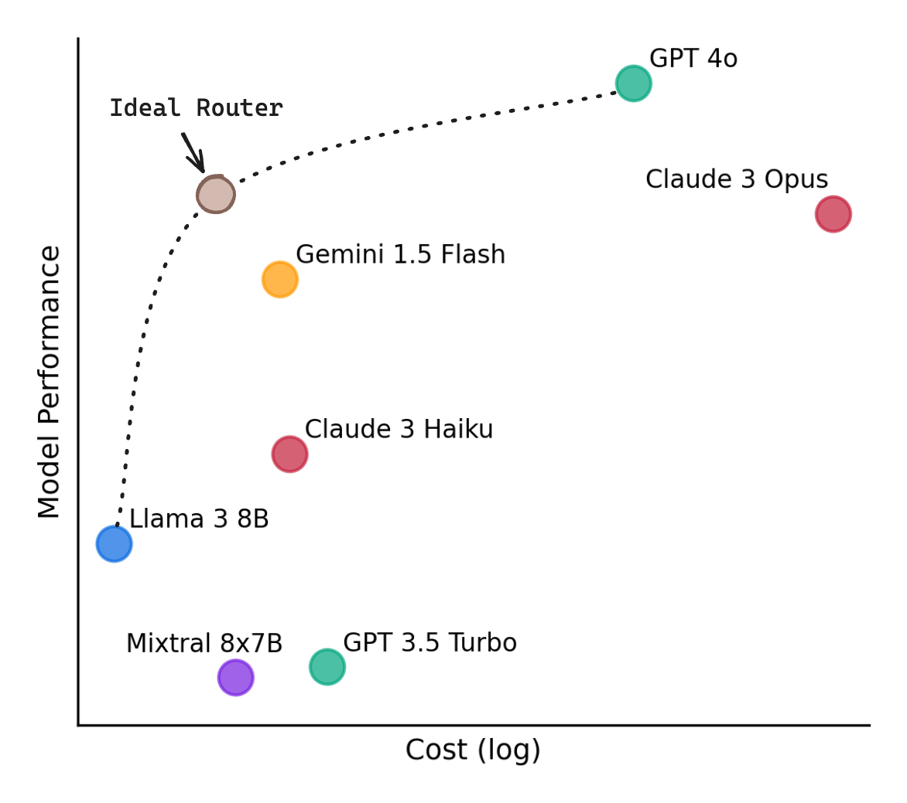

# RouteLLM

RouteLLM is a framework for serving and evaluating LLM routers.

[ [Blog](http://lmsys.org/blog/2024-07-01-routellm/) ] [ [Paper](https://arxiv.org/abs/2406.18665) ]

<p align="center">
  
</p>

Our core features include:

- Drop-in replacement for OpenAI's client (or launch an OpenAI-compatible server) to route simpler queries to cheaper models.
- Trained routers are provided out of the box, which we have shown to **reduce costs by up to 85%** while maintaining **95% GPT-4 performance** on widely-used benchmarks like MT Bench.
- Benchmarks also demonstrate that these routers achieve the same performance as commercial offerings while being **>40% cheaper**. 
- Easily extend the framework to include new routers and compare the performance of routers across multiple benchmarks.

## Installation

**From PyPI**
```
pip install "routellm[serve,eval]"
```

**From source**

```
git clone https://github.com/lm-sys/RouteLLM.git
cd RouteLLM
pip install -e .[serve,eval]
```

## Quickstart

Let's walkthrough replacing an existing OpenAI client to route queries between LLMs instead of using only a single model.

1. First, let's replace our OpenAI client by initializing the RouteLLM controller with the `mf` router. By default, RouteLLM will use the best-performing config:
```python
import os
from routellm.controller import Controller

os.environ["OPENAI_API_KEY"] = "sk-XXXXXX"
# Replace with your model provider, we use Anyscale's Mixtral here.
os.environ["ANYSCALE_API_KEY"] = "esecret_XXXXXX"

client = Controller(
  routers=["mf"],
  strong_model="gpt-4-1106-preview",
  weak_model="anyscale/mistralai/Mixtral-8x7B-Instruct-v0.1",
)
```
Above, we pick `gpt-4-1106-preview` as the strong model and `anyscale/mistralai/Mixtral-8x7B-Instruct-v0.1` as the weak model, setting the API keys accordingly. You can route between different model pairs or providers by updating the model names as described in [Model Support](#model-support).

Want to route to local models? Check out [Routing to Local Models](examples/routing_to_local_models.md).

2. Each routing request has a *cost threshold* that controls the tradeoff between cost and quality. We should calibrate this based on the types of queries we receive to maximize routing performance. As an example, let's calibrate our threshold for 50% GPT-4 calls using data from Chatbot Arena.
```
> python -m routellm.calibrate_threshold --routers mf --strong-model-pct 0.5 --config config.example.yaml
For 50.0% strong model calls for mf, threshold = 0.11593
```
This means that we want to use `0.11593` as our threshold so that approximately 50% of all queries (those that require GPT-4 the most) will be routed to it (see [Threshold Calibration](#threshold-calibration) for details).

3. Now, let's update the `model` field when we generate completions to specify the router and threshold to use:
```python
response = client.chat.completions.create(
  # This tells RouteLLM to use the MF router with a cost threshold of 0.11593
  model="router-mf-0.11593",
  messages=[
    {"role": "user", "content": "Hello!"}
  ]
)
```
That's it! Now, requests with be routed between the strong and weak model depending on what is required, **saving costs while maintaining a high quality of responses**.

Depending on your use case, you might want to consider using a different model pair, modifying the configuration, or calibrating the thresholds based on the types of queries you receive to improve performance.

### Server & Demo

Instead of using the Python SDK, you can also launch an OpenAI-compatible server that will work with any existing OpenAI client, using similar steps:
```
> export OPENAI_API_KEY=sk-XXXXXX
> export ANYSCALE_API_KEY=esecret_XXXXXX
> python -m routellm.openai_server --routers mf --strong-model gpt-4-1106-preview --weak-model anyscale/mistralai/Mixtral-8x7B-Instruct-v0.1
INFO:     Application startup complete.
INFO:     Uvicorn running on http://0.0.0.0:6060 (Press CTRL+C to quit)
```

Once the server is launched, you can start a local router chatbot to see how different messages are routed.
```
python -m examples.router_chat --router mf --threshold 0.11593
```

<p align="center">
  
</p>

### Model Support

In the above examples, GPT-4 and Mixtral 8x7B are used as the model pair, but you can modify this using the `strong-model` and `weak-model` arguments.

We leverage [LiteLLM](https://github.com/BerriAI/litellm) to support chat completions from a wide-range of open-source and closed models. In general, you need a setup an API key and point to the provider with the appropriate model name. Alternatively, you can also use **any OpenAI-compatible endpoint** by prefixing the model name with `openai/` and setting the `--base-url` and `--api-key` flags.

Note that regardless of the model pair used, an `OPENAI_API_KEY` will currently still be required to generate embeddings for the `mf` and `sw_ranking` routers.

Instructions for setting up your API keys for popular providers:
- Local models with Ollama: see [this guide](examples/routing_to_local_models.md)
- [Anthropic](https://litellm.vercel.app/docs/providers/anthropic#api-keys)
- [Gemini - Google AI Studio](https://litellm.vercel.app/docs/providers/gemini#sample-usage)
- [Amazon Bedrock](https://litellm.vercel.app/docs/providers/bedrock#required-environment-variables)
- [Together AI](https://litellm.vercel.app/docs/providers/togetherai#api-keys)
- [Anyscale Endpoints](https://litellm.vercel.app/docs/providers/anyscale#api-key)

For other model providers, find instructions [here](https://litellm.vercel.app/docs/providers) or raise an issue.

## Motivation

Different LLMs vary widely in their costs and capabilities, which leads to a dilemma when deploying them: routing all queries to the most capable model leads to the highest-quality responses but can be very expensive, while routing queries to smaller models can save costs but may result in lower-quality responses. 

*LLM routing* offers a solution to this. We introduce a router that looks at queries and routes simpler queries to smaller, cheaper models, saving costs while maintaining quality. We focus on routing between 2 models: a stronger, more expensive model and a cheaper but weaker model. Each request is also associated with a _cost threshold_ that determines the cost-quality tradeoff of that request - a higher cost threshold leads to lower cost but may lead to lower-quality responses.

The research in this repository was conducted in [collaboration with Anyscale](https://www.anyscale.com/blog/building-an-llm-router-for-high-quality-and-cost-effective-responses), and we are grateful for their help and support.

## Server

RouteLLM offers a lightweight OpenAI-compatible server for routing requests based on different routing strategies:

```
python -m routellm.openai_server --routers mf --config config.example.yaml
```

- `--routers` specifies the list of routers available to the server. For instance, here, the server is started with one available router: `mf` (see below for the list of routers).
- `--config` specifies the path to the configuration file for the routers. If unspecified, the server will default to using our best-performing configuration (see [Configuration](#configuration) for details).

For most use-cases, **we recommend the `mf` router** as we have evaluated it to be very strong and lightweight.

When making a request to the server, clients specify the router and cost threshold to use for each request using the `model` field in the following format `router-[ROUTER NAME]-[THRESHOLD]`. For instance, using a `model` of `router-mf-0.5` specifies that the request should be routed using the `mf` router with a threshold of 0.5.

### Threshold Calibration

The threshold used for routing controls the cost-quality tradeoff. The range of meaningful thresholds varies depending on the type of router and the queries you receive. Therefore, we recommend calibrating thresholds using a sample of your incoming queries, as well as the % of queries you'd like to route to the stronger model.

By default, we support calibrating thresholds based on the public [Chatbot Arena dataset](https://huggingface.co/datasets/lmsys/lmsys-arena-human-preference-55k). For example, to calibrate the threshold for the `mf` router such that 50% of calls are routed to the stronger model:

```
> python -m routellm.calibrate_threshold --task calibrate --routers mf --strong-model-pct 0.5 --config config.example.yaml
For 50.0% strong model calls for mf, threshold = 0.11593
```

This means that the threshold should be set to 0.1881 for the `mf` router so that approximately 50% of calls are routed to the strong model i.e. using a `model` field of `router-mf-0.1159`.

However, note that because we calibrate the thresholds based on an existing dataset, the % of calls routed to each model will differ based on the actual queries received. Therefore, we recommend calibrating on a dataset that closely resembles the types of queries you receive.

## Evaluation

RouteLLM also includes an evaluation framework to measure the performance of different routing strategies on benchmarks.

To evaluate a router on a benchmark, you can use the following command:
```
python -m routellm.evals.evaluate --routers random sw_ranking bert --benchmark gsm8k --config config.example.yaml 
```

- `--routers` specifies the list of routers to evaluate, for instance, `random` and `bert` in this case.
- `--benchmark` specifies the specific benchmark to evaluate the routers on. We currently support: `mmlu`, `gsm8k`, and `mt-bench`.

Evaluation results will be printed to the console. A plot of router performance will also be generated in the current directory (override the path using `--output`). To avoid recomputing results, the results for a router on a given benchmark is cached by default. This behavior can be overridden by using the `--overwrite-cache` flag, which takes in a list of routers to overwrite the cache for.

The results for all our benchmarks have been cached. For MT Bench, we use the precomputed judgements for the desired model pair. For MMLU and GSM8K, we utilized [SGLang](https://github.com/sgl-project/sglang) to compute the results for the desired model pair - the full code for this can be found in the benchmark directories if you would like to evaluate a different model pair.

By default, GPT-4 and Mixtral are used as the model pair for evaluation. To modify the model pair used, set them using the `--strong-model` and `--weak-model` flags.

## Routers

Out of the box, RouteLLM supports 4 routers trained on the `gpt-4-1106-preview` and `mixtral-8x7b-instruct-v0.1` model pair.

The full list of routers:
1. `mf`: Uses a matrix factorization model trained on the preference data (recommended).
2. `sw_ranking`: Uses a weighted Elo calculation for routing, where each vote is weighted according to how similar it is to the user's prompt.
3. `bert`: Uses a BERT classifier trained on the preference data.
4. `causal_llm`: Uses a LLM-based classifier tuned on the preference data.
5. `random`: Randomly routes to either model.

While these routers have been trained on the `gpt-4-1106-preview` and `mixtral-8x7b-instruct-v0.1` model pair, we have found that these routers generalize well to other strong and weak model pairs as well. Therefore, you can replace the model pair used for routing without having to retrain these models!

We also provide detailed instructions on how to train the LLM-based classifier in the following [notebook](https://github.com/anyscale/llm-router/blob/main/README.ipynb).

For the full details, refer to our [paper](https://arxiv.org/abs/2406.18665).

## Configuration

The configuration for routers is specified in either the `config` argument for `Controller` or by passing in the path to a YAML file using the `--config` flag. It is a top-level mapping from router name to the keyword arguments used for router initialization.

An example configuration is provided in the `config.example.yaml` file - it provides the configurations for routers that have trained on Arena data augmented using GPT-4 as a judge. The models and datasets used are all hosted on Hugging Face under the [RouteLLM](https://huggingface.co/routellm) and [LMSYS](https://huggingface.co/lmsys) organizations.

## Contribution

We welcome contributions! Please feel free to open an issue or a pull request if you have any suggestions or improvements.

### Adding a new router

To add a new router to RouteLLM, implement the abstract `Router` class in `routers.py` and add the new router to the `ROUTER_CLS` dictionary. Then, you can use immediately the new router in the server or evaluation framework.

There is only a single method to implement: `calculate_strong_win_rate`, which takes in the user prompt and returns the win rate for the strong model conditioned on that given prompt - if this win rate is great than user-specified cost threshold, then the request is routed to the strong model. Otherwise, it is routed to the weak model.

### Adding a new benchmark

To add a new benchmark to RouteLLM, implement the abstract `Benchmark` class in `benchmarks.py` and update the `evaluate.py` module to properly initialize the new benchmark class. Ideally, the results for the benchmark should be precomputed to avoid having to regenerate the results for each evaluation run -- see the existing benchmarks for examples on how to do this.

# Citation

The code in this repository is based on the research from the [paper](https://arxiv.org/abs/2406.18665). Please cite if you find the repository helpful.

```
@misc{ong2024routellmlearningroutellms,
      title={RouteLLM: Learning to Route LLMs with Preference Data},
      author={Isaac Ong and Amjad Almahairi and Vincent Wu and Wei-Lin Chiang and Tianhao Wu and Joseph E. Gonzalez and M Waleed Kadous and Ion Stoica},
      year={2024},
      eprint={2406.18665},
      archivePrefix={arXiv},
      primaryClass={cs.LG},
      url={https://arxiv.org/abs/2406.18665},
}
```
