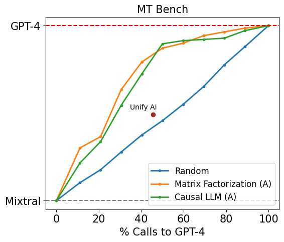
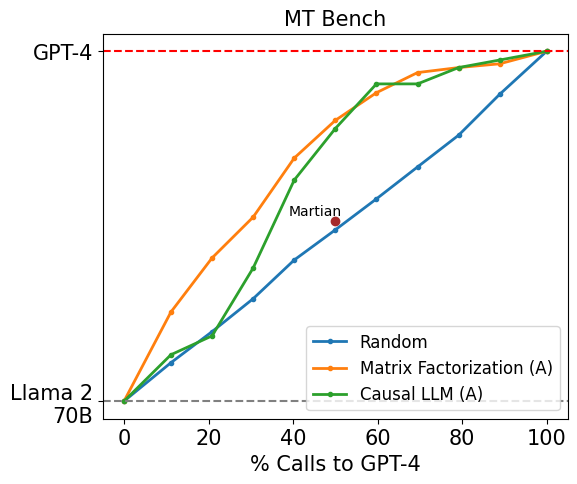

# Benchmarks

## RouteLLM vs Commercial Offerings

In our [blog](https://lmsys.org/blog/2024-07-01-routellm/), we report MT Bench results comparing our routers to [Martian](https://withmartian.com) and [Unify AI](https://unify.ai), two commercial offerings for routing. We conduct these benchmarks using the official [FastChat](https://github.com/lm-sys/FastChat/tree/main/fastchat/llm_judge) repository, replacing model calls to either Martian or Unify AI using an OpenAI-compatible server.

<p align="center">
  
</p>

For Unify AI, we pick the best-performing router on the user dashboard `router@q:1|c:1.71e-03|t:1.10e-05|i:1.09e-03` and use it for benchmarking, allowing calls to either GPT-4 Turbo or Mixtral 8x7B. Using this router, we obtain a MT Bench score of `8.757862` with `45.625%` of calls routed to GPT-4. In comparison, our best-performing router achieves the same performance with 25.40% GPT-4 calls.

```python
client = openai.OpenAI(
	base_url="https://api.unify.ai/v0/",
	api_key="UNIFY_API_KEY"
)
response = client.chat.completions.create(
        model="router@q:1|c:1.71e-03|t:1.10e-05|i:1.09e-03|models:gpt-4-turbo,mixtral-8x7b-instruct-v0.1",
		...
    )
```

<p align="center">
  
</p>

For Martian, we allow calls to either GPT-4 Turbo or Llama 2 70B Chat based on the [list of supported models](https://docs.withmartian.com/martian-model-router/model-router/supported-models-router). Because the API does not return which model each request is routed to, we use the `max_cost_per_million_tokens` parameter to estimate the % of GPT-4 calls. Specifically, we set the `max_cost_per_million_tokens` to be $10.45, a value approximated using public inference costs for `llama-2-70b-chat` and `gpt-4-turbo-2024-04-09` from [Together.AI](https://www.together.ai/pricing) and [OpenAI](https://openai.com/api/pricing/). Given a per M tokens cost of $0.90 for Llama 2 70B Chat and per M tokens cost of $20 for GPT-4 Turbo (assuming a 1:1 input:output ratio), we calculate `($20 + $0.90) / 2 = $10.45` so that approximately 50% of calls are routed to GPT-4. Using this, we obtain a MT Bench score of `8.3125`. In comparison, our best-performing router achieves the same performance with 29.66% GPT-4 calls.

```python
client = openai.OpenAI(
    base_url="https://withmartian.com/api/openai/v1",
    api_key="MARTIAN_API_KEY",
)
response = client.chat.completions.create(
        model="router",
        extra_body={
            "models": ["gpt-4-turbo-128k", "llama-2-70b-chat"],
            "max_cost_per_million_tokens": 10.45,
        },
		...
    )
```

The full MT Bench results and judgements are available in the `mt-bench/` directory.
